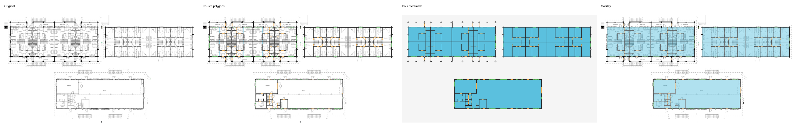
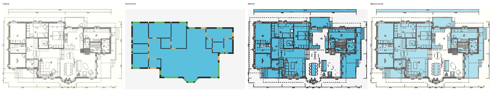
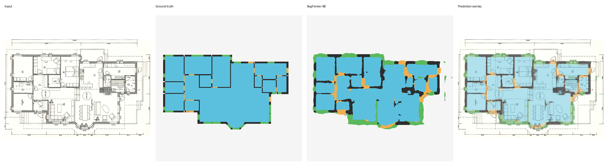
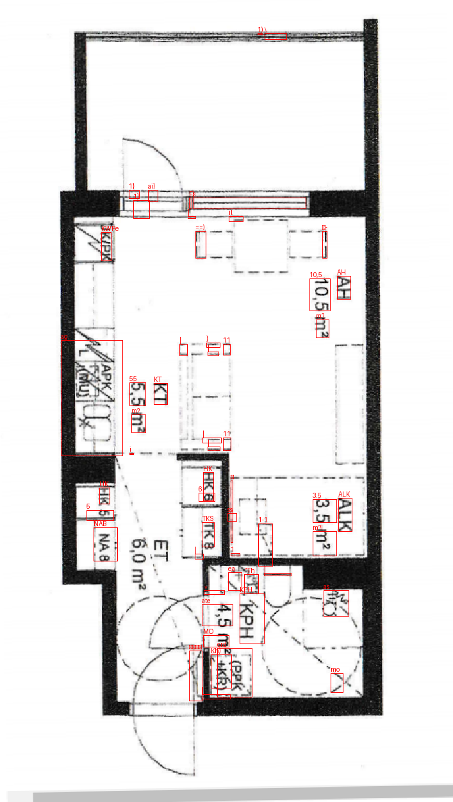

# Floor Plan Document Intelligence

This independent portfolio project turns raster architectural floor plans into
machine-readable building information. Phases 0--3 establish a verified
CubiCasa5K ingestion path, a reproducible dataset audit, a classical baseline,
a learned five-class segmentation model, and a local OCR prototype.

> This independent portfolio project was inspired by a public Upwork requirement
> for software that converts architectural floor-plan images into structured
> geometry. It was not commissioned by, developed for, or endorsed by the
> original client.

## Current pipeline

```text
CubiCasa image + SVG annotation
              |
              v
Verified 5-class mask (background / room / wall / door / window)
              |
              v
Dataset audit + alignment contact sheets
              |
              v
Classical morphology baseline -> held-out reference metrics
              |
              v
SegFormer-B0 -> five-class masks, overlays and held-out metrics
              |
              v
Tesseract 5 -> text tokens, boxes and coarse entity labels
```

## Dataset and licensing

[CubiCasa5K](https://github.com/CubiCasa/CubiCasa5k) contains 5,000 floor plans
with dense SVG polygon annotations. The dataset is licensed separately under
[CC BY-NC 4.0](https://github.com/CubiCasa/CubiCasa5k/blob/master/LICENSE); its
archive and derivatives are not committed here. The repository's code is MIT
licensed. Dataset provenance: [Zenodo record 2613548](https://zenodo.org/records/2613548),
DOI `10.5281/zenodo.2613548`.

The task mapping is intentionally narrow and fully documented in
`data/category_mapping.yaml`. It follows the selectors used by CubiCasa5K's
official `House` parser, excludes outdoor spaces and railings, and uses explicit
`window > door > wall > room > background` overlap precedence.

## Reproduce

Python 3.11 or 3.12 is required. Every Python command below runs inside the local
virtual environment.

```powershell
uv venv --python 3.12 .venv
uv pip install --python .venv\Scripts\python.exe -e ".[dev]"
.\.venv\Scripts\python.exe scripts\download_dataset.py
.\.venv\Scripts\python.exe scripts\install_tesseract.py

# Development: do not inspect test.
.\.venv\Scripts\python.exe scripts\audit_dataset.py --splits train val
.\.venv\Scripts\python.exe scripts\tune_baseline.py --max-samples 100
.\.venv\Scripts\python.exe scripts\evaluate_baseline.py --split val

# Only after configs/baseline.yaml is frozen.
.\.venv\Scripts\python.exe scripts\audit_dataset.py --splits test --allow-test
.\.venv\Scripts\python.exe scripts\evaluate_baseline.py --split test --allow-test
.\.venv\Scripts\python.exe -m pytest
```

The downloader obtains the archive through the Zenodo API, checks the
repository-provided checksum, validates archive paths, and extracts locally.
Official `train.txt`, `val.txt`, and `test.txt` membership is never reshuffled.
The Tesseract installer is placed under `.venv\Tesseract-OCR`; no system-wide
OCR installation is required.

## Results

The complete train/validation audit parsed all 4,600 files without corruption or
annotation failure. Visual checks cover simple, dense, highest/lowest-resolution,
opening-heavy and unusual-aspect plans.

| Split | Plans | Rooms | Walls | Doors | Windows | Parse failures |
|---|---:|---:|---:|---:|---:|---:|
| Train | 4,200 | 45,002 | 110,624 | 42,004 | 36,985 | 0 |
| Validation | 400 | 4,189 | 10,188 | 3,853 | 3,395 | 0 |
| Test | 400 | 4,351 | 10,711 | 4,088 | 3,629 | 0 |

Class imbalance is substantial. Training pixel frequencies are 54.55%
background, 37.81% room, 5.76% wall, 0.59% door and 1.29% window.



The baseline configuration was selected on the first 100 official validation
plans, frozen in commit `054408d`, and then evaluated once on all 400 held-out
test plans. Door/window scores are zero by design.

| Class | IoU | Dice | Precision | Recall |
|---|---:|---:|---:|---:|
| Background | 0.698 | 0.822 | 0.850 | 0.796 |
| Room | 0.613 | 0.760 | 0.791 | 0.732 |
| Wall | 0.251 | 0.401 | 0.286 | 0.670 |
| Door | 0.000 | 0.000 | n/a | 0.000 |
| Window | 0.000 | 0.000 | n/a | 0.000 |

Held-out five-class mIoU is 0.312; mean foreground IoU is 0.216. Median baseline
CPU inference time is 0.028 seconds per plan (annotation parsing and image I/O
excluded). Machine-readable outputs live under `results/dataset_audit/` and
`results/baseline/`; locally generated contact sheets make alignment and
baseline behaviour visually inspectable.



### Phase 2: learned segmentation

SegFormer-B0 is initialized from the public ADE20K checkpoint, its classifier is
reinitialized for the project's five labels, and it is fine-tuned with weighted
cross-entropy plus Dice loss. A deterministic 1,200-plan subset of official
training data and all 400 validation plans were used for model selection. The
epoch-18 checkpoint was frozen in commit `6a3cb1d` before evaluating the 400
official test plans.

| Class | IoU | Dice | Precision | Recall |
|---|---:|---:|---:|---:|
| Background | 0.922 | 0.959 | 0.991 | 0.930 |
| Room | 0.828 | 0.906 | 0.925 | 0.888 |
| Wall | 0.532 | 0.694 | 0.586 | 0.852 |
| Door | 0.195 | 0.327 | 0.202 | 0.845 |
| Window | 0.409 | 0.580 | 0.431 | 0.887 |

Held-out five-class mIoU is **0.577** and foreground mIoU is **0.491**;
inference has a 2.13 ms median GPU forward-pass time per cached plan (image I/O
and mask rendering excluded). Door recall is high but precision remains low, so
opening geometry needs further work before it can support CAD-grade output.



### Phase 3: OCR prototype

The OCR workflow uses a reproducible, held-out synthetic benchmark with room
labels, drawing codes and dimensions, then applies the selected method to real
CubiCasa validation plans for qualitative inspection. Raw 2x upscaling was
chosen on the 80-sample validation split (75.0% exact match, 21.4% CER), ahead
of adaptive thresholding. With that choice frozen, it scored 78.8% exact match,
16.2% CER, 23.8% WER, 64.7% numeric-token accuracy and 90.7% room-label
accuracy on the separate 80-sample synthetic test split.

Real-plan detections are visual examples only: their source annotations do not
provide text transcriptions, so they are not presented as an OCR accuracy claim.
The prototype reports Tesseract word boxes and coarse labels (`ROOM_LABEL`,
`DIMENSION_LIKE`, `DRAWING_CODE`, or `OTHER`).



## Baseline limitations

The baseline detects dark axis-aligned structures with adaptive thresholding and
morphology, then treats enclosed white components as room candidates. It does
not predict doors or windows. Text and furniture can become false walls, open
doorways can leak room regions into exterior whitespace, and curves or diagonal
walls are poorly represented. Its role is to provide an honest lower bound for
the learned model in the next phase, not to claim CAD-quality extraction.

See [the methodology](docs/methodology.md), [data instructions](data/README.md),
and [the public job reference](docs/job_reference/source.md) for detail.
